# CMC-SpeedRun
速通[全国大学生数学竞赛](http://www.cmathc.cn/)教程(非数学专业)

>针对🐹🐹的CMC-SpeedRun

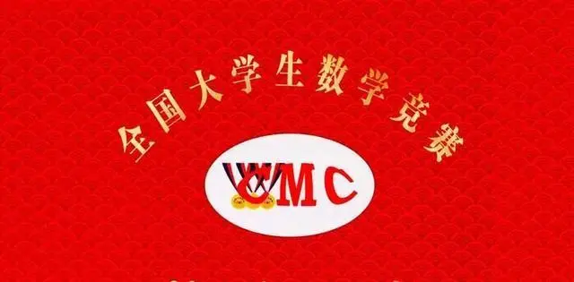

- [CMC-SpeedRun](#cmc-speedrun)
- [前言](#前言)
  - [读者须知](#读者须知)
  - [🐹🐹情况](#情况)
- [如何速通](#如何速通)
  - [第零步：准备工作](#第零步准备工作)
    - [三角函数部分](#三角函数部分)
    - [导数工具部分](#导数工具部分)
    - [数列部分](#数列部分)
    - [不等式部分](#不等式部分)
    - [反三角函数部分](#反三角函数部分)
  - [第一步：打好基础](#第一步打好基础)
  - [第二步：各章节知识点DLC](#第二步各章节知识点dlc)
    - [第一章 函数、极限、连续](#第一章-函数极限连续)
      - [**Cauthy极限存在准则**](#cauthy极限存在准则)
      - [**Cauthy极限公式**](#cauthy极限公式)
      - [**奥特曼法**](#奥特曼法)
      - [**Stolz定理**](#stolz定理)
      - [**中值定理求极限的方法**](#中值定理求极限的方法)
      - [**Stirling公式**](#stirling公式)
      - [**无穷大量的比较**](#无穷大量的比较)
      - [**Darboux定理**](#darboux定理)
    - [第二章 一元函数微分学](#第二章-一元函数微分学)
    - [第三章 一元函数积分学](#第三章-一元函数积分学)
      - [**区间再现公式**](#区间再现公式)
      - [**Wallis公式**](#wallis公式)
      - [**三角函数有关的积分公式**](#三角函数有关的积分公式)
      - [**积分中值定理**](#积分中值定理)
    - [第四章 多元函数微分学](#第四章-多元函数微分学)
    - [第五章 多元数量值函数积分学](#第五章-多元数量值函数积分学)
      - [**二重积分的和式极限**](#二重积分的和式极限)
      - [**雅可比行列式**](#雅可比行列式)
      - [**二重积分的换元公式**](#二重积分的换元公式)
      - [**二重积分的分部积分公式**](#二重积分的分部积分公式)
    - [第六章 多元向量值函数积分学](#第六章-多元向量值函数积分学)
      - [**三重积分换元公式**](#三重积分换元公式)
    - [第七章 常微分方程](#第七章-常微分方程)
      - [**Liouville公式**](#liouville公式)
      - [**常数变易法**](#常数变易法)
    - [第八章 无穷级数](#第八章-无穷级数)
  - [第三步：开始速通真题](#第三步开始速通真题)
- [资料库](#资料库)
  - [推荐书籍](#推荐书籍)
  - [往届真题](#往届真题)
    - [初赛](#初赛)
    - [决赛](#决赛)
  - [权威公众号](#权威公众号)
- [🐹🐹的笔记](#的笔记)

# 前言

## 读者须知
本文适用于国内准大学生、大学生对CMC(全国大学生数学竞赛)或其他类似竞赛有准备需要的学生或者🐹🐹。

注意是**非数，非数，非数**！鼠鼠是CS学生，所以参加的是非数学类的CMC！本SpeedRun教程也是针对非数的教程。

一般CMC比赛时间：初赛每年11月左右，决赛每年3月左右，具体情况具体分析。

含金量：一般(主观而言)。

尤其是刚学完微积分课程的学生来说，知识掌握程度最佳，基本上不用准备也可能拿到初赛的三等奖，当然拿奖与否，跟你报名的赛区也是息息相关。

## 🐹🐹情况
高考数学全国一卷120(并非你想的那么高) 所以人人都有机会完美速通CMC
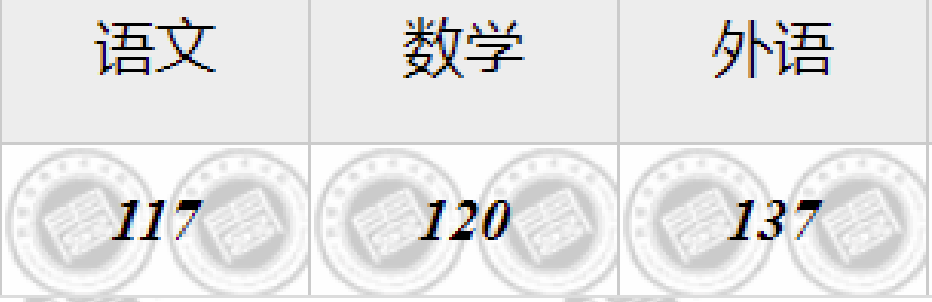

高数上总评98 
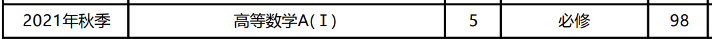

高数下总评92 
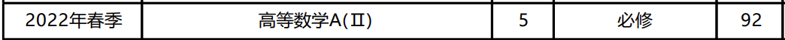

线代总评97
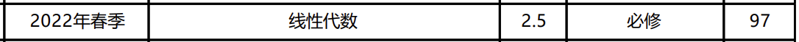

离散数学总评95
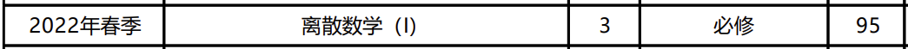

大二参加第十四届全国大学生数学竞赛,初赛66分一等奖 (校内名单)
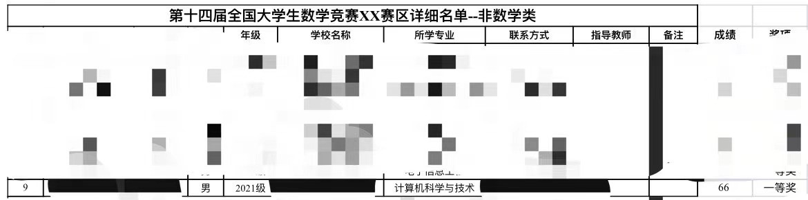

张贴在此处以增加🐹🐹文章的信服力。

# 如何速通
首先必须说明，在本科之前的基础也是重要的，尤其是三角函数、导数等工具的掌握，可能会影响本科课程中微积分的学习，但是影响不算巨大。

为了避免部分🐹🐹不知所措，茫然前行，本🐹🐹根据个人经验✍不断完善此库，以便帮助各位实现速通CMC。

在下文，我将列出在国内正常高中学习会涉及并且CMC中也会出现的数学工具。

已经在本科学习完微积分课程**并且总评优秀**的可以跳过第零步和第一步。

## 第零步：准备工作
### 三角函数部分

除了高中必修的三角函数变换、辅助角变换之后，大部分人都对积化和差、和差化积、万能公式不太熟悉，不必要死记硬背，但是遇到题目要能想到这一条退路。

下面三组公式常常在CMC中的求极限、求积分等题目中有出奇制胜的效果。

推导、记忆技巧等，详见各类辅助教材、网站。

积化和差

${\displaystyle \sin \alpha \cos \beta ={\sin(\alpha +\beta )+\sin(\alpha -\beta ) \over 2}} \\ {\displaystyle \cos \alpha \sin \beta ={\sin(\alpha +\beta )-\sin(\alpha -\beta ) \over 2}} \\ {\displaystyle \cos \alpha \cos \beta ={\cos(\alpha +\beta )+\cos(\alpha -\beta ) \over 2}} \\ {\displaystyle \sin \alpha \sin \beta =-{\cos(\alpha +\beta )-\cos(\alpha -\beta ) \over 2}} \\$

和差化积

${\displaystyle \sin \alpha +\sin \beta =2\sin {\frac {\alpha +\beta }{2}}\cos {\frac {\alpha -\beta }{2}}} \\ {\displaystyle \sin \alpha -\sin \beta =2\cos {\alpha +\beta \over 2}\sin {\alpha -\beta \over 2}} \\ {\displaystyle \cos \alpha +\cos \beta =2\cos {\frac {\alpha +\beta }{2}}\cos {\frac {\alpha -\beta }{2}}} \\ {\displaystyle \cos \alpha -\cos \beta =-2\sin {\alpha +\beta \over 2}\sin {\alpha -\beta \over 2}}$

万能公式

$\sin{x}=\frac{2t}{1+t^2}\\ \cos{x}=\frac{1-t^2}{1+t^2}\\ \tan{x}=\frac{2t}{1-t^2}\\ x=2\arctan{t}\\$

### 导数工具部分

所有初等函数的导数，链式法则，以及最重要的一个，**取对数求导法**。

### 数列部分

基本的裂项，不动点法。

### 不等式部分

均值不等式、**柯西不等式**、**常见放缩**。

### 反三角函数部分

需要掌握定义、导数、以及**一些常见恒等式**

$arctan\frac{a-b}{1+ab}=arctan(a)-arctan(b)$

$arctanx+arctan\frac{1}{x}=\frac{\pi}{2}$

## 第一步：打好基础
我将在这部分主要叙述各个阶段的应对措施，希望能够帮助到各位🐹🐹

教材我们学校用的是同济的高等数学，🐹🐹也有幸溜进交大上过一次微分方程的课，他们用的是高等教育出版社的《工科数学分析基础》，各自教材差别不算特别大，最好还是根据你们上课的教材为主。

如果您正在进行微积分课程/高等数学课程/数学分析课程，在能保证目前所学内容掌握良好的情况下，自学后续内容能够更好地帮助实现速通。

如果很不幸，您跟不上您正在进行的微积分课程，请参考目录中的**资料库-推荐书籍**进行额外努力，打好基础是速通的必要条件。

如果很幸运您恰好学完了微积分课程，并且掌握情况良好，请直接参考第二步，您也不需要基础的辅助教材。

具体来说，我没遇到什么特别难的微积分的题目，只要跟着老师或者自学，按部就班学习的话，基本上课内成绩不会太差。

其次，要明确 **能力!=分数** ，绝大多数情况下，分数只能做个参考，特别是大部分高校评价成绩都是采用平时和卷面占比来计算成绩，所以请各位🐹🐹不要太放在心上。

## 第二步：各章节知识点DLC

在打好基础的情况下，也就是你对微积分掌握了绝大部分，但是CMC或者考研会要求更多一点点，在此处，鼠鼠将会详细列出正常课程中没有的内容，也就是俗称**DLC**

下面🐹🐹按照浦和平的《大学生数学竞赛教程》的目录来进行扩展**进阶**的知识点，注意是**进阶**，所以课内一些基础的、简单的我不会提及。

涉及的是扩展内容，不是本体内容。也就是**额外内容(DLC)**

对于食用DLC，本🐹🐹的建议是结合辅导书，**根据DLC内容进行练习，而不是死记知识点**。

### 第一章 函数、极限、连续

#### **Cauthy极限存在准则**
数列$\{ {x}_{n}\}$收敛的充分必要条件是：

对于任意给定的正数$\epsilon$,存在正整数${\\N}$,使得当$m>N,n>N$时，有$\\|x_n-x_m|<\epsilon$

#### **Cauthy极限公式**
若$\lim\limits_{n\rightarrow\infty}a_n=A$,则$\lim\limits_{n\rightarrow\infty}{\frac{a_1+a_2+...+a_n}{n}}=A$

#### **奥特曼法**
百度贴吧流传已久的一种求极限方法，其本质是“抓大头”，也就是变化最快的一个。数学语言描述如下：

$\lim\limits_{n\rightarrow\infty}{\sqrt[n]{a^n+b^n+c^n}}=max\{a,b,c\}$

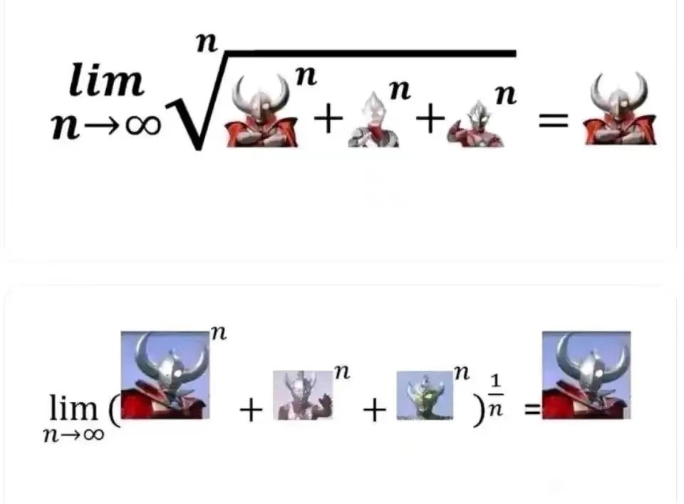

#### **Stolz定理**

俗称数列的L'Hospital定理

(1) 定理一($\frac{*}{\infty}$型)

设数列$a_n,b_n$满足:

$b_n$严格单调递增

且$\lim\limits_{n\rightarrow\infty}{b_n}=+\infty$

那么,有
$\lim\limits_{n\rightarrow\infty}{\frac{a_n}{b_n}}={\lim\limits_{n\rightarrow\infty}\frac{a_{n+1}-a_n}{b_{n+1}-b_n}}=L,$其中$L$可以是有限数、$+\infty$、$-\infty$

(2) 定理二 ($\frac{0}{0}$型)
设数列$a_n,b_n$满足:

$b_n$严格单调递减且趋于零

且$\lim\limits_{n\rightarrow\infty}{a_n}=0$

那么,有
$\lim\limits_{n\rightarrow\infty}{\frac{a_n}{b_n}}={\lim\limits_{n\rightarrow\infty}\frac{a_{n+1}-a_n}{b_{n+1}-b_n}}=L,$其中$L$可以是有限数、$+\infty$、$-\infty$

#### **中值定理求极限的方法**

这个只能结合例题来说明；

#### **Stirling公式**

斯特林公式(Stirling公式)

>用一坨答辩来逼近$n!$

$\lim\limits_{n\rightarrow\infty}{\frac{e^nn!}{n^n\sqrt{n}}}=\sqrt{2\pi}$

比较少数的CMC题目可以直接用这个公式。

#### **无穷大量的比较**

如果学过算法分析，理解起来很容易，其实就是时间复杂度的比较。

当$n\rightarrow+\infty$时，有

$\ln n < n^{\alpha} < n^{\beta}<a^n<n!<n^n$

$(0<\alpha<\beta, a>1)$

所以可以直接有：
$\lim\limits_{n\rightarrow\infty}{\frac{n!}{n^n}}=0$

#### **Darboux定理**

$f(x)$的导函数$f'(x)$在$[a,b]$上不一定连续，

若$f'(x)=\alpha$,$f'(x)=\beta$,则$\exist\xi\in(a,b)$使$f'(\xi)$介于$\alpha,\beta$之间

### 第二章 一元函数微分学

### 第三章 一元函数积分学

#### **区间再现公式**

1.$\int_{a}^{b}f(x)dx=\int_{a}^{b}f(a+b-x)dx$

2.若$f(x)$关于$x=\frac{a+b}{2}$对称，则$\int_{a}^{b}xf(x)dx=\frac{a+b}{2}\int_{a}^{b}f(x)dx$

特例，也是常见的公式：

$\int_{0}^{\pi}xf(sinx)dx=\frac{\pi}{2}\int_{0}^{\pi}f(sinx)dx$

#### **Wallis公式**

当$n$为偶数时，

$\int_{0}^{\frac{\pi}{2}}sin^nxdx=\int_{0}^{\frac{\pi}{2}}cos^nxdx=\frac{n-1}{n}\frac{n-3}{n-2}......\frac{3}{4}\frac{1}{2}\frac{\pi}{2}$

当$n$为奇数时，

$\int_{0}^{\frac{\pi}{2}}sin^nxdx=\int_{0}^{\frac{\pi}{2}}cos^nxdx=\frac{n-1}{n}\frac{n-3}{n-2}......\frac{2}{3}$

#### **三角函数有关的积分公式**

#### **积分中值定理**

**积分第一中值定理**
若$f(x)$在闭区间$[a,b]$上连续，$g(x)$在$[a,b]$不变号，且$g(x)$在$[a,b]$上是可积的，则在$[a,b]$上至少存在一个点$\epsilon$,使得：

$\int_{a}^{b}f(x)g(x)dx=f(\epsilon)\int_{a}^{b}g(x)dx$

**积分第二中值定理**

### 第四章 多元函数微分学

### 第五章 多元数量值函数积分学

#### **二重积分的和式极限**

请类比一元积分的定义，这部分将很好理解。

#### **雅可比行列式**

#### **二重积分的换元公式**

#### **二重积分的分部积分公式**

### 第六章 多元向量值函数积分学

#### **三重积分换元公式**

### 第七章 常微分方程

#### **Liouville公式**

对于二阶线性齐次微分方程

$y''+p(x)y'+q(x)y=0$

已知一个特解$y_1$,则另一个线性无关的特解为$y_2=y_1\int{\frac{1}{y_1^2}e^{-\int{p(x)dx}}}dx$

证明：

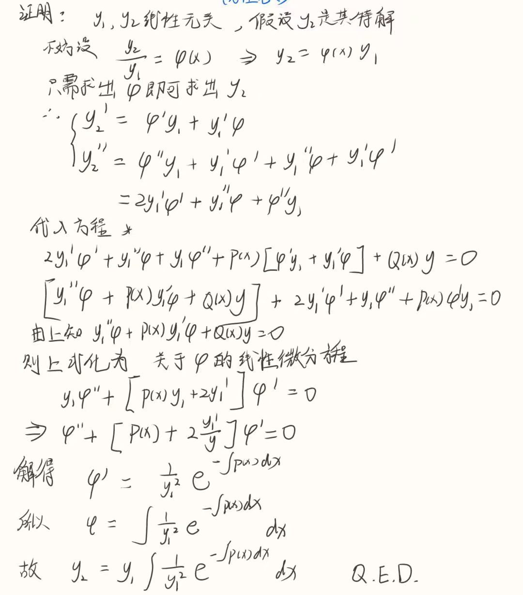

#### **常数变易法**

第十三届CMC初赛中，大题第三题可以直接用常数变易法解方程，然后再判断有界性，相比给出的奇技淫巧，更为简单粗暴，可以直接求得答案。

### 第八章 无穷级数

## 第三步：开始速通真题

# 资料库

## 推荐书籍

**1.数学分析习题集-吉米多维奇著**

俗称就是吉米多维奇习题集。

**非常不建议全部做一遍，因为非常多，会耗费大量时间。**（鼠鼠的个人观点）

可以偶尔翻两下。

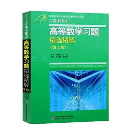

**2.大学生数学竞赛教程-蒲和平著**

俗称大绿书，鼠鼠当初只用了这一本书，推荐指数🌟🌟🌟

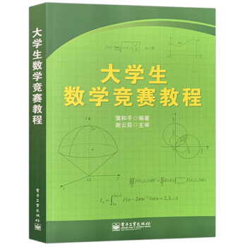

**3.大学生数学竞赛习题精讲-陈兆斗著**

没做过，听说还不错。鼠鼠就只用过大绿书，比鼠鼠努力且有时间的可以试试这本。

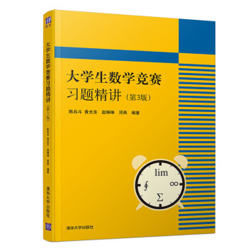

**4.普林斯顿微积分读本**

略读过，感觉有点cjb了，就是辅导差生学好微积分而已，个人觉得用处不大。

因为如果你能在系统的学习下掌握知识，那么这种书对你来说就是鸡肋。

推荐的原因是，如果你是小白，那么这本书还是不错的。

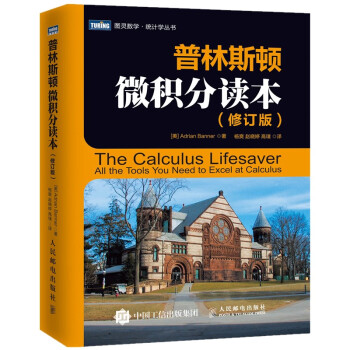

**5.数学女孩系列**

神中神，🐹🐹高中时期午休时光的精神食粮，对我来说附带青春buff，而且里面很多数学科普知识跨度很大，从幼儿园到人类前沿，漫游各个领域的数学知识，属于提升素养方面的书籍。

放在本速通教程中纯属是🐹🐹个人推荐，对速通CMC或许有着无用之用的用处。

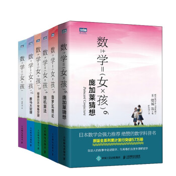

## 往届真题

截止到目前鼠鼠更新本库，一共进行了十四届CMC，算上补赛的题目，

### 初赛

### 决赛

## 权威公众号

不得不说一个非常权威的公众号：

**考研竞赛数学**

里面各种真题、模拟题、每日一题等等等等，内容丰富。

# 🐹🐹的笔记

本🐹🐹在数学方面记的东西是少之又少，但是多少还是有点硬通货的，我将会把pdf版本的笔记放在本github库中，以便其他🐹🐹参考学习，请各位斧正。
