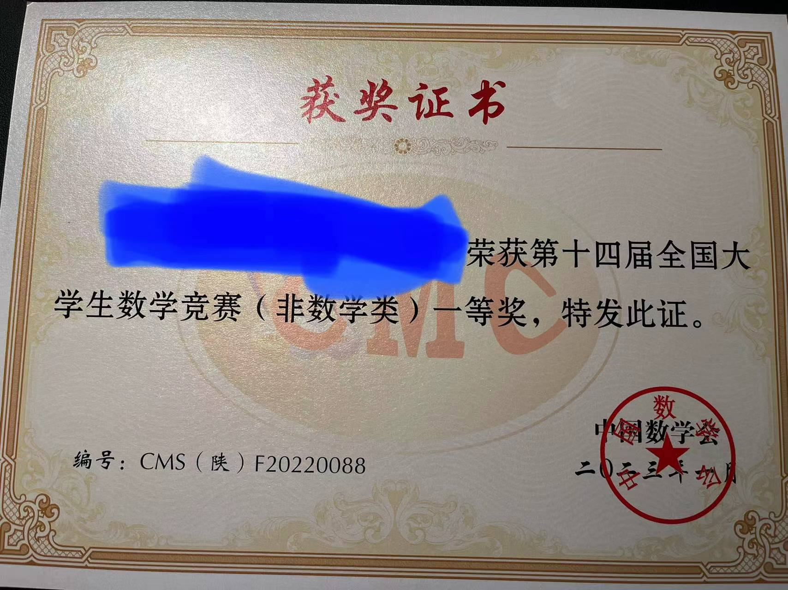
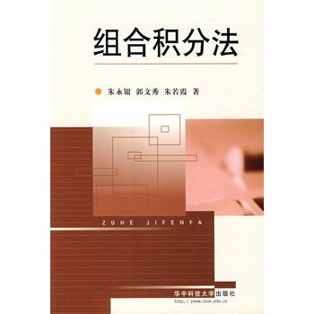
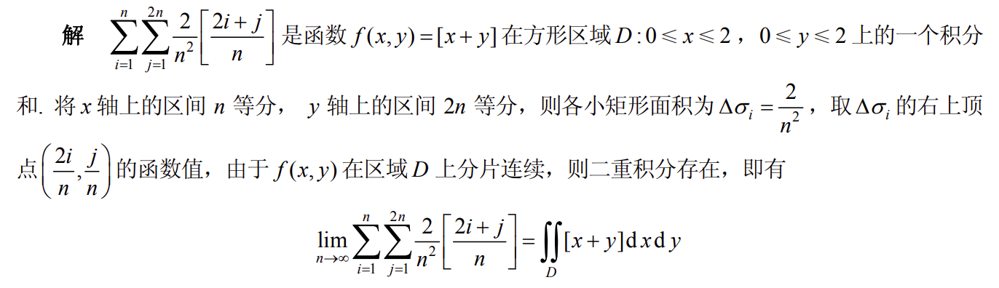
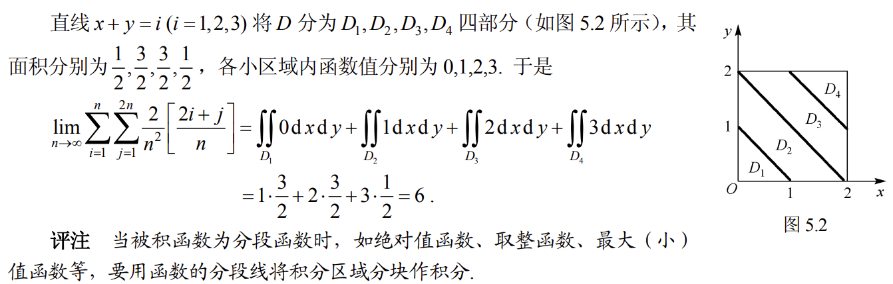
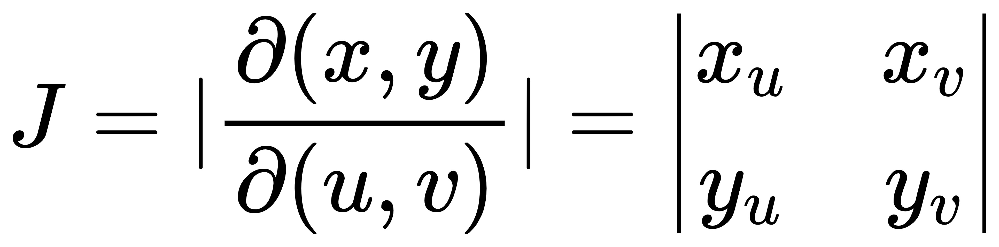
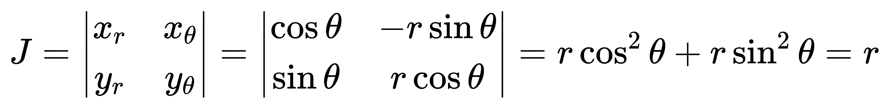
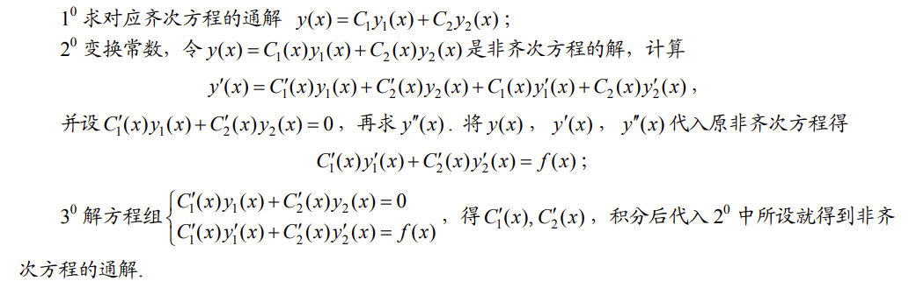

# CMC-SpeedRun

  

速通[全国大学生数学竞赛](http://www.cmathc.cn/)教程(非数学专业)

>针对🐹🐹的CMC-SpeedRun

- [CMC-SpeedRun](#cmc-speedrun)
- [前言](#前言)
  - [读者须知](#读者须知)
  - [🐹🐹情况](#情况)
- [如何速通](#如何速通)
  - [第零步：准备工作](#第零步准备工作)
    - [🌟三角函数部分](#三角函数部分)
    - [🌟导数工具部分](#导数工具部分)
    - [🌟数列部分](#数列部分)
    - [🌟不等式部分](#不等式部分)
    - [🌟反三角函数部分](#反三角函数部分)
  - [第一步：打好基础](#第一步打好基础)
  - [第二步：各章节知识点DLC](#第二步各章节知识点dlc)
    - [1️⃣第一章 函数、极限、连续](#1️⃣第一章-函数极限连续)
      - [🌟**Cauchy极限存在准则**](#cauchy极限存在准则)
      - [🌟**Cauchy极限公式**](#cauchy极限公式)
      - [🌟**奥特曼法**](#奥特曼法)
      - [🌟**Stolz定理**](#stolz定理)
      - [🌟**中值定理求极限的方法**](#中值定理求极限的方法)
      - [🌟**Stirling公式**](#stirling公式)
      - [🌟**无穷大量的比较**](#无穷大量的比较)
      - [🌟**Darboux定理**](#darboux定理)
      - [🌟**一致连续的定义**](#一致连续的定义)
      - [🌟**Lipschitz条件**](#lipschitz条件)
    - [2️⃣第二章 一元函数微分学](#2️⃣第二章-一元函数微分学)
      - [🌟**凑导数定义**](#凑导数定义)
      - [🌟**Leibniz公式**](#leibniz公式)
    - [3️⃣第三章 一元函数积分学](#3️⃣第三章-一元函数积分学)
      - [🌟**区间再现公式**](#区间再现公式)
      - [🌟**Wallis公式**](#wallis公式)
      - [🌟**三角函数有关的积分公式**](#三角函数有关的积分公式)
      - [🌟**积分中值定理**](#积分中值定理)
      - [🌟**组合积分法**](#组合积分法)
      - [🌟**积分形式Cauchy-Schwarz不等式**](#积分形式cauchy-schwarz不等式)
    - [4️⃣第四章 多元函数微分学](#4️⃣第四章-多元函数微分学)
      - [🌟**偏导数与连续的关系**](#偏导数与连续的关系)
      - [🌟**二元函数Taylor展开**](#二元函数taylor展开)
    - [5️⃣第五章 多元数量值函数积分学](#5️⃣第五章-多元数量值函数积分学)
      - [🌟**二重积分的和式极限**](#二重积分的和式极限)
      - [🌟**雅可比行列式**](#雅可比行列式)
      - [🌟**二重积分的换元公式**](#二重积分的换元公式)
      - [🌟**二重积分的极坐标换元**](#二重积分的极坐标换元)
      - [🌟**二重积分的球面坐标换元**](#二重积分的球面坐标换元)
      - [🌟**二重积分的分部积分公式**](#二重积分的分部积分公式)
      - [🌟**三重积分换元公式**](#三重积分换元公式)
      - [🌟**三重积分柱面坐标换元**](#三重积分柱面坐标换元)
      - [🌟**三重积分球面坐标换元**](#三重积分球面坐标换元)
    - [6️⃣第六章 多元向量值函数积分学](#6️⃣第六章-多元向量值函数积分学)
      - [🌟**Green公式**](#green公式)
      - [🌟**Stokes公式**](#stokes公式)
      - [🌟**Gauss公式**](#gauss公式)
    - [7️⃣第七章 常微分方程](#7️⃣第七章-常微分方程)
      - [🌟**可化为齐次方程的微分方程**](#可化为齐次方程的微分方程)
      - [🌟**Bernoulli方程**](#bernoulli方程)
      - [🌟**Euler方程**](#euler方程)
      - [🌟**Liouville公式**](#liouville公式)
      - [🌟**常数变易法**](#常数变易法)
    - [8️⃣第八章 无穷级数](#8️⃣第八章-无穷级数)
      - [🌟**Euler常数**](#euler常数)
      - [🌟**拉链定理**](#拉链定理)
      - [🌟**Cauchy乘积**](#cauchy乘积)
      - [🌟**Cauchy收敛定理**](#cauchy收敛定理)
      - [🌟**Weierstrass准则**](#weierstrass准则)
      - [🌟**Parseval恒等式**](#parseval恒等式)
  - [第三步：开始速通真题](#第三步开始速通真题)
- [资料库](#资料库)
  - [推荐书籍](#推荐书籍)
  - [往届真题](#往届真题)
    - [初赛](#初赛)
    - [决赛](#决赛)
  - [权威公众号](#权威公众号)
- [🐹🐹的笔记](#的笔记)
- [联系🐹🐹](#联系)

# 前言

## 读者须知
本文适用于国内准大学生、大学生对CMC(全国大学生数学竞赛)或其他类似竞赛有准备需要的学生或者🐹🐹。

注意是**非数，非数，非数**！鼠鼠是CS学生，所以参加的是非数学类的CMC！本SpeedRun教程也是针对非数的教程。

一般CMC比赛时间：初赛每年11月左右，决赛每年3月左右，具体情况具体分析。

尤其是刚学完微积分课程的学生来说，知识掌握程度最佳，基本上不用准备也可能拿到初赛的三等奖，当然拿奖与否，跟你报名的赛区也是息息相关。

本文加入了适量emoji表情以增加可读性,请见谅。

前排：如果Github你下载太慢，欢迎前往以下链接下载
https://www.aliyundrive.com/s/qun3Q7sy5EG

## 🐹🐹情况
下面介绍一下🐹🐹的情况。

高考数学全国一卷120(并非你想的那么高) 所以人人都有机会完美速通CMC

高数上总评98 

高数下总评92 

线代总评97

离散数学总评95

从课内成绩来看，🐹🐹算是中规中矩，前期的铺垫固然重要，但是要速通CMC，后期的努力更重要。

大二参加第十四届全国大学生数学竞赛,初赛66分一等奖 (校内名单，所以有具体分数)

张贴在此处以增加🐹🐹文章的信服力,不然大街上随便找坨史也可以写这篇文章。

2023年6月补档，的确没有进入决赛，这里给大家一个参考，第十四届陕西省初赛66分编号88应该是全省88名没有达到决赛线。

# 如何速通
首先必须说明，在本科之前的基础也是重要的，尤其是三角函数、导数等工具的掌握，可能会影响本科课程中微积分的学习，但是影响不算巨大。

为了避免部分🐹🐹不知所措，茫然前行，本🐹🐹根据个人经验✍不断完善此库，以便帮助各位实现速通CMC。

在下文，我将列出在国内正常高中学习会涉及并且CMC中也会出现的数学工具,接下来是各种扩展知识点的介绍，最后是关于真题和一些资料的建议和推荐。

已经在本科学习完微积分课程**并且总评优秀**的可以跳过第零步和第一步。

## 第零步：准备工作
### 🌟三角函数部分

除了高中必修的三角函数变换、辅助角变换之后，大部分人都对积化和差、和差化积、万能公式不太熟悉，不必要死记硬背，但是遇到题目要能想到这一条退路。

下面三组公式常常在CMC中的求极限、求积分等题目中有出奇制胜的效果。

推导、记忆技巧等，详见各类辅助教材、网站。

**积化和差**

${\displaystyle \sin \alpha \cos \beta ={\sin(\alpha +\beta )+\sin(\alpha -\beta ) \over 2}}$

${\displaystyle \cos \alpha \sin \beta ={\sin(\alpha +\beta )-\sin(\alpha -\beta ) \over 2}}$

${\displaystyle \cos \alpha \cos \beta ={\cos(\alpha +\beta )+\cos(\alpha -\beta ) \over 2}}$

${\displaystyle \sin \alpha \sin \beta =-{\cos(\alpha +\beta )-\cos(\alpha -\beta ) \over 2}}$

**和差化积**

${\displaystyle \sin \alpha +\sin \beta =2\sin {\frac {\alpha +\beta }{2}}\cos {\frac {\alpha -\beta }{2}}}$

${\displaystyle \sin \alpha -\sin \beta =2\cos {\alpha +\beta \over 2}\sin {\alpha -\beta \over 2}}$

${\displaystyle \cos \alpha +\cos \beta =2\cos {\frac {\alpha +\beta }{2}}\cos {\frac {\alpha -\beta }{2}}}$

${\displaystyle \cos \alpha -\cos \beta =-2\sin {\alpha +\beta \over 2}\sin {\alpha -\beta \over 2}}$

**万能公式**

$\displaystyle \sin{x}=\frac{2t}{1+t^2}$

$\displaystyle \cos{x}=\frac{1-t^2}{1+t^2}$

${\displaystyle \tan{x}=\frac{2t}{1-t^2}}$

${\displaystyle x=2\arctan{t}}$

### 🌟导数工具部分

所有初等函数的导数，链式法则，以及最重要的一个，**取对数求导法**。

例如，求
$y=x^x$
的导数

> $\ln y =x\ln x$

再求导,后面的步骤我就不说了。

### 🌟数列部分

基本的裂项，不动点法。

### 🌟不等式部分

均值不等式、**柯西不等式**、**常见放缩**。

### 🌟反三角函数部分

需要掌握定义、导数、以及**一些常见恒等式**

$arctan\frac{a-b}{1+ab}=arctan(a)-arctan(b)$

$arctanx+arctan\frac{1}{x}=\frac{\pi}{2}$

## 第一步：打好基础
我将在这部分主要叙述各个阶段的应对措施，希望能够帮助到各位🐹🐹

教材我们学校用的是同济的高等数学，🐹🐹也有幸溜进交大上过一次微分方程的课，他们用的是高等教育出版社的《工科数学分析基础》，各自教材差别不算特别大，最好还是根据你们上课的教材为主。

如果您正在进行微积分课程/高等数学课程/数学分析课程，在能保证目前所学内容掌握良好的情况下，自学后续内容能够更好地帮助实现速通。

如果很不幸，您跟不上您正在进行的微积分课程，请参考目录中的**资料库-推荐书籍**进行额外努力，打好基础是速通的必要条件。

如果很幸运您恰好学完了微积分课程，并且掌握情况良好，请直接参考第二步，您也不需要基础的辅助教材。

具体来说，我没遇到什么特别难的微积分的题目，只要跟着老师或者自学，按部就班学习的话，基本上课内成绩不会太差。

其次，要明确 **能力!=分数** ，绝大多数情况下，分数只能做个参考，特别是大部分高校评价成绩都是采用平时和卷面占比来计算成绩，所以请各位🐹🐹不要太放在心上。

## 第二步：各章节知识点DLC

在打好基础的情况下，也就是你对微积分掌握了绝大部分，但是CMC或者考研会要求更多一点点，在此处，鼠鼠将会详细列出正常课程中没有的内容，也就是俗称**DLC**

下面🐹🐹按照浦和平的《大学生数学竞赛教程》的目录来进行扩展**进阶**的知识点，注意是**进阶**，所以课内一些基础的、简单的我不会提及。

涉及的是扩展内容，不是本体内容。也就是**额外内容(DLC)**

对于食用DLC，本🐹🐹的建议是结合辅导书，**根据DLC内容进行练习，而不是死记知识点**。

### 1️⃣第一章 函数、极限、连续

#### 🌟**Cauchy极限存在准则**
数列
$x_n$
收敛的充分必要条件是：

对于任意给定的正数
$\epsilon$
,存在正整数
${N}$
,使得当
$m>N,n>N$
时，有
$\|x_n-x_m|<\epsilon$

#### 🌟**Cauchy极限公式**
若
$\lim\limits_{n\rightarrow\infty}a_n=A$
,则
$\lim\limits_{n\rightarrow\infty}{\frac{a_1+a_2+...+a_n}{n}}=A$

#### 🌟**奥特曼法**
百度贴吧流传已久的一种求极限方法，其本质是“抓大头”，也就是变化最快的一个。数学语言描述如下：

$\lim\limits_{n\rightarrow\infty}{\sqrt[n]{a^n+b^n+c^n}}=max{\\{a,b,c\\}}$

#### 🌟**Stolz定理**

俗称数列的L'Hospital定理

(1) 定理一(
$\frac{*}{\infty}$
型)

设数列
$a_n,b_n$
满足:

$b_n$
严格单调递增

且
$\lim\limits_{n\rightarrow\infty}{b_n}=+\infty$

那么,有
$\lim\limits_{n\rightarrow\infty}{\frac{a_n}{b_n}}={\lim\limits_{n\rightarrow\infty}\frac{a_{n+1}-a_n}{b_{n+1}-b_n}}=L,$
其中
$L$
可以是有限数、
$+\infty$
、
$-\infty$

(2) 定理二 (
$\frac{0}{0}$
型)

设数列
$a_n,b_n$
满足:

$b_n$
严格单调递减且趋于零

且
$\lim\limits_{n\rightarrow\infty}{a_n}=0$

那么,有
$\lim\limits_{n\rightarrow\infty}{\frac{a_n}{b_n}}={\lim\limits_{n\rightarrow\infty}\frac{a_{n+1}-a_n}{b_{n+1}-b_n}}=L,$
其中
$L$
可以是有限数、
$+\infty$、
$-\infty$

#### 🌟**中值定理求极限的方法**

首先要先掌握一些中值定理，详见第三章DLC。

这个只能结合例题来说明；

例如，求极限
$\lim\limits_{x\rightarrow3}\frac{\sin{x^x}-\sin{3^x}}{3^{x^x}-3^{3^x}}$

解:
$\lim\limits_{x\rightarrow3}\frac{\sin{x^x}-\sin{3^x}}{3^{x^x}-3^{3^x}}=\lim\limits_{x\rightarrow3}\frac{\cos{\xi}}{3^\xi\ln 3}$
,其中
$\xi$
介于
$x^x$
和
$3^x$
之间，

所以
$\lim\limits_{x\rightarrow3}\frac{\sin{x^x}-\sin{3^x}}{3^{x^x}-3^{3^x}}=\lim\limits_{x\rightarrow3}\frac{\cos{\xi}}{3^\xi\ln 3}=\frac{\cos9}{3^9\ln 3}$

#### 🌟**Stirling公式**

斯特林公式(Stirling公式)

>用一坨答辩来逼近
$n!$

$\lim\limits_{n\rightarrow\infty}{\frac{e^nn!}{n^n\sqrt{n}}}=\sqrt{2\pi}$

比较少数的CMC题目可以直接用这个公式。

#### 🌟**无穷大量的比较**

如果学过算法分析，理解起来很容易，其实就是时间复杂度的比较。

当
$n\rightarrow+\infty$
时，有

$\ln n$
$<$
$n^{\alpha}$
$<$
$n^{\beta}$
$<$
$a^n$
$<$
$n!$
$<$
$n^n$

$(0<\alpha<\beta, a>1)$

所以可以直接有：

$\lim\limits_{n\rightarrow\infty}{\frac{n!}{n^n}}=0$

#### 🌟**Darboux定理**

$f(x)$
的导函数
$f'(x)$
在
$[a,b]$
上不一定连续，

若
$f'(x)=\alpha$
,
$f'(x)=\beta$
,则
$\exists\xi\in(a,b)$
使
$f'(\xi)$
介于
$\alpha,\beta$
之间

#### 🌟**一致连续的定义**

了解即可。

对于任意
$\epsilon>0$
,
$\exists\delta>0$
使得对于任意
$x_1,x_2\in I$
当满足
$\|x_1-x_2|<\delta$
时，有
$\|f(x_1)-f(x_2)|<\epsilon$
恒成立，则该函数在区间
$I$
上一致连续。

#### 🌟**Lipschitz条件**

了解即可。

对于在实数集子集的函数
$f:D\subseteq R$
,若
$\exists$
常数
$k$
对于任意
$a,b\in D$
使得
$\|f(a)-f(b)|\le k\|a-b|$
,则称
$f$
符合Lipschitz条件，
$k_{min}$
为Lipschitz常数，符合Lipschitz条件的
$f$
必然一致连续，反之不一定。

### 2️⃣第二章 一元函数微分学

#### 🌟**凑导数定义**

经常需要最原始的导数的定义来解决问题，所以虽然是很基础的内容，但是这里特地提一嘴。

$f'(x_0)=\lim\limits_{x\rightarrow x_0}\frac{f(x)-f(x_0)}{x-x_0}$

或者

$f'(x_0)=\lim\limits_{\Delta x\rightarrow 0}\frac{f(x_0+\Delta x)-f(x_0)}{\Delta x}$

#### 🌟**Leibniz公式**

非常常见的求高阶导数的公式，使用频率很高。

$(f(n)\cdot g(n))^{(n)}=\sum C_n^i f^{(i)}(x)\cdot g^{(n-i)}(x)$

### 3️⃣第三章 一元函数积分学

#### 🌟**区间再现公式**

1.有
$\int_{a}^{b}f(x)dx=\int_{a}^{b}f(a+b-x)dx$

2.若
$f(x)$
关于
$x=\frac{a+b}{2}$
对称，则
$\int_{a}^{b}xf(x)dx=\frac{a+b}{2}\int_{a}^{b}f(x)dx$

特例，也是常见的公式：

$\int_{0}^{\pi}xf(sinx)dx=\frac{\pi}{2}\int_{0}^{\pi}f(sinx)dx$

#### 🌟**Wallis公式**

俗称点火公式/华莱士公式。

当
$n$
为偶数时，

$\int_{0}^{\frac{\pi}{2}}sin^nxdx=\int_{0}^{\frac{\pi}{2}}cos^nxdx=\frac{n-1}{n}\frac{n-3}{n-2}......\frac{3}{4}\frac{1}{2}\frac{\pi}{2}$

当
$n$
为奇数时，

$\int_{0}^{\frac{\pi}{2}}sin^nxdx=\int_{0}^{\frac{\pi}{2}}cos^nxdx=\frac{n-1}{n}\frac{n-3}{n-2}......\frac{2}{3}$

#### 🌟**三角函数有关的积分公式**

除了区间再现和Wallis公式之外，还有一些小的积分公式。

此外，要常常想起**和差半倍**的一些公式，有利于积分，以及一些分部积分的技巧。

**公式1**：

$\int_{0}^{\frac{\pi}{2}}f(\sin x)dx=\int_{0}^{\frac{\pi}{2}}f(\cos x)dx$

证明1：

令
$x=\frac{\pi}{2}-t$
，剩下的你来。

**公式2**:

$\int_{0}^{\pi}xf(\sin x)dx=\frac{\pi}{2}\int_{0}^{\pi}f(\sin x)dx$

证明2：

令
$x=\pi-t$
，剩下的你来。

#### 🌟**积分中值定理**

**积分第一中值定理**

若
$f(x)$
在闭区间
$[a,b]$
上连续，
$g(x)$
在
$[a,b]$
不变号，且
$g(x)$
在
$[a,b]$
上是可积的，则在
$[a,b]$
上至少存在一个点
$\epsilon$
,使得：

$\int_{a}^{b}f(x)g(x)dx=f(\epsilon)\int_{a}^{b}g(x)dx$

#### 🌟**组合积分法**

这种积分的方法真要说，可以出一本书来讲。

不过这里介绍的只是一点点皮毛，主要思路是,观察所求积分的特点，再利用对称的积分或者一些已知的积分，然后用不定积分的加减法来得到线性方程，再接着解方程，从而求得一些复杂积分的解。

经典的例子：

求积分
$\int{\frac{\sin x}{\sin x+\cos x}}dx$

解：
记所求积分为
$I=\int{\frac{\sin x}{\sin x+\cos x}}dx$

考虑另外一个积分
$J=\int{\frac{\cos x}{\sin x+\cos x}}dx$

则有
$I+J=\int{\frac{\sin x+\cos x}{\sin x+\cos x}}dx=\int dx=x+C$

又因为
$J-I=\int{\frac{\cos x-\sin x}{\sin x+\cos x}}dx=\int{\frac{1}{\sin x+\cos x}}d{(\cos x+\sin x)}=\ln{\|\sin x+\cos x|}+C$

上述俩个式子相减，得到
$2I=x+\ln{\|\sin x+\cos x|}+C$

则
$I=\frac{x}{2}+\frac{1}{2} \ln{\|\sin x+\cos x|}+C$

更多内容，详见各教辅或其他工具书。

#### 🌟**积分形式Cauchy-Schwarz不等式**

$(\int f(x)g(x)dx)^2 \le \int f^2(x)dx \cdot \int g^2(x)dx$

### 4️⃣第四章 多元函数微分学

#### 🌟**偏导数与连续的关系**

按照同济教材的内容，一般都是

俩个偏导数在点
$(x,y)$
存在且连续，则可以推出函数在该点可微。

**但是**，实际上，只需要一个偏导数存在(不一定连续)，另一个偏导数存在且连续,则可以推出函数在该点可微。

#### 🌟**二元函数Taylor展开**

首先引入记号：

$(h\frac{\partial }{\partial x}+k\frac{\partial}{\partial y})f(x_0,y_0)$
表示
$hf_x(x_0,y_0)+kf_y(x_0,y_0)$

同样的，

$(h\frac{\partial }{\partial x}+k\frac{\partial}{\partial y})^2f(x_0,y_0)$
表示
$h^2f_{xx}(x_0,y_0)+2hkf_{xy}(x_0,y_0)+k^2f_{xy}(x_0,y_0)$

更一般地，

$(h\frac{\partial }{\partial x}+k\frac{\partial}{\partial y})^{m}f(x_0,y_0)$
表示

$\sum_{p=0}^{m}C_{m}^{p}h^pk^{m-p}\frac{\partial ^mf}{\partial x^p\partial y^{m-p}}|_{(x_0,y_0)}$

设
$z=f(x,y)$
在点
$(x_0,y_0)$
的某一邻域内有直到
$n+1$
阶连续偏导数，
$(x_0+h,y_0+k)$
为此邻域内任一点，则有

$f(x_0+h,y_0+k)=f(x_0,y_0)+(h\frac{\partial}{\partial x}+k\frac{\partial}{\partial y})f(x_0,y_0)+\frac{1}{2!}(h\frac{\partial}{\partial x}+k\frac{\partial}{\partial y})^2f(x_0,y_0)+...+\frac{1}{n!}(h\frac{\partial}{\partial x}+k\frac{\partial}{\partial y})^nf(x_0,y_0)+R_n$

其中，
$R_n=\frac{1}{(n+1)!}(h\frac{\partial}{\partial x}+k\frac{\partial}{\partial y})^{n+1}f(x_0+\theta h,y_0+\theta k)$

其中，
$(0 \lt \theta \lt 1)$

这就是
$f$
在点
$(x_0,y_0)$
的
$n$
阶泰勒展开公式，其中
$R_n$
被称为拉格朗日余项。

### 5️⃣第五章 多元数量值函数积分学

#### 🌟**二重积分的和式极限**

请类比一元积分的定义，这部分将很好理解。

下面用例题来说明；

**大绿书第五章例3**：

计算
$\lim\limits_{n\rightarrow\infty}\sum_{i=1}^{n}\sum_{j=1}^{2n}{\frac{2}{n^2}[\frac{2i+j}{n}]}$
,这里
$[x]$
是不超过
$x$
的最大整数.

解：

#### 🌟**雅可比行列式**

重积分换元的必经之路，**雅可比(Jacobi)行列式**。

看懂下面的部分需要线性代数基础,并且我只针对下面需要用到的的换元公式来说明该部分，详情请自行查阅、搜索。

直观上说，雅可比行列式表示
$xOy$
平面上的面积微元和换元后的
$uOv$
平面上的面积微元的比值。

设
$x=x(u,v),y=y(u,v)$

则Jacobi行列式

则有
$dxdy=|J|dudv$

注意**一定要加绝对值**。

#### 🌟**二重积分的换元公式**

下面介绍一般的二重积分换元公式

结合上述的Jacobi行列式，换元变得迎刃而解。

作换元
$x=x(u,v),y=y(u,v)$

则
$\iint_{D}f(x,y)dxdy=\iint_{D'}f[x(u,v),y(u,v)]\cdot {|J|}dudv$

注意**一定要加绝对值**。

具体能怎么运用呢？实际上可以参考**大绿书第五章例9的方法2**

它这题方法2实际上是线性变换，可以参考线性代数里面的线性变换.

#### 🌟**二重积分的极坐标换元**

一般换元公式的特例之一。

只需要将具体的换元代入即可。

作换元
$x=r\cos \theta,y=r\sin \theta$

于是

则有
$dxdy=rdrd\theta$

现在知道极坐标换元的面积微元怎么来的吧~

注意**一定要加绝对值**。

#### 🌟**二重积分的球面坐标换元**

一般换元公式的特例之一。

#### 🌟**二重积分的分部积分公式**

把格林(Green)公式中被积函数换成俩函数乘积即可推出二重积分的分部积分公式。

$\iint_{\Omega}f\frac{\partial g}{\partial x}dxdy=\oint_{\partial \Omega}(f\cdot g)dy-\iint_{\Omega}g\frac{\partial f}{\partial x}dxdy$

$\iint_{\Omega}f\frac{\partial g}{\partial y}dxdy=-\oint_{\partial \Omega}(f\cdot g)dx-\iint_{\Omega}g\frac{\partial f}{\partial y}dxdy$

#### 🌟**三重积分换元公式**

类比于二重积分换元公式。

#### 🌟**三重积分柱面坐标换元**

类比于二重积分柱面坐标换元。

#### 🌟**三重积分球面坐标换元**

类比于二重积分球面坐标换元。

### 6️⃣第六章 多元向量值函数积分学

其实第六章内容不多，无非就是前面的积分整一整，再多几个向量形式的积分公式而已。

#### 🌟**Green公式**

课内已有，不再赘述。

#### 🌟**Stokes公式**

课内已有，不再赘述。

#### 🌟**Gauss公式**

课内已有，不再赘述。

### 7️⃣第七章 常微分方程

人类对微分方程的研究其实不多，很多微分方程人类都是解不出来的，所以CMC应该不会出太难的微分方程的题目。

这部分DLC不多。

#### 🌟**可化为齐次方程的微分方程**

#### 🌟**Bernoulli方程**

形如
$y'+P(x)y=Q(x)y^n$
的微分方程

俩边同时除
$y^n$
即可得到

$y^{-n}\frac{dy}{dx}+P(x)y^{1-n}=Q(x)$

之后再换元
$z=y^{1-n}$

解关于
$z$
的一阶线性微分方程即可。 

#### 🌟**Euler方程**

以二阶的微分方程为例子（n阶同理）:

对于方程
$x^2y''+pxy'+qy=f(x)$

作变量代换
$x=e^t$
或
$t=\ln x$
，方程化为二阶常系数线性微分方程

$D(D-1)y+pDy+qy=f(e^t)$

其中，
$D=\frac{d}{dt}$

#### 🌟**Liouville公式**

对于二阶线性齐次微分方程

$y''+p(x)y'+q(x)y=0$

已知一个特解
$y_1$
,则另一个线性无关的特解为
$$y_2=y_1\int{\frac{1}{y_1^2}e^{-\int{p(x)dx}}}dx$$

证明：

#### 🌟**常数变易法**

第十三届CMC初赛中，大题第三题可以直接用常数变易法解方程，然后再判断有界性，相比给出的奇技淫巧，更为简单粗暴，可以直接求得答案。

比如常数变易法求二阶线性方程
$y''+py'+qy=f(x)$
的步骤：

### 8️⃣第八章 无穷级数

#### 🌟**Euler常数**

了解即可，一个发散级数带来的常数。

$\sum_{i=1}^{\infty} \frac{1}{n}=\ln n+ \gamma$

其中，
$\gamma \approx 0.57721 56649$
为欧拉常数。

换句话说，

$\sum_{i=1}^{\infty} \frac{1}{n}-\ln n= \gamma$

$(0<\alpha<\beta, a>1)$

所以可以直接有：

$\lim\limits_{n\rightarrow\infty}{\frac{n!}{n^n}}=0$

#### 🌟**拉链定理**

其实这个点也可以放在第一章里面。

数列收敛的**充要条件**是其奇、偶子数列收敛于同一极限。

#### 🌟**Cauchy乘积**

也叫做俩数列的离散卷积。

Cauchy乘积的定义为：

对于俩个级数
$\sum_{n=0}^{\infty}a_n$
和
$\sum_{n=0}^{\infty}b_n$
,不论其敛散性，其Cauchy乘积为:

$(\sum_{n=0}^{\infty}a_n)\cdot(\sum_{n=0}^{\infty}b_n)=\sum_{n=0}^{\infty}(\sum_{m=0}^{n}a_mb_{n-m})$

#### 🌟**Cauchy收敛定理**

若
$\sum_{n=0}^{\infty}a_n$
和
$\sum_{n=0}^{\infty}b_n$
绝对收敛，且
$\sum_{n=0}^{\infty}a_n=A$
,
$\sum_{n=0}^{\infty}b_n=B$
则其**柯西乘积**绝对收敛，且收敛到
$A\cdot B$

也就是说，
$(\sum_{n=0}^{\infty}a_n)\cdot(\sum_{n=0}^{\infty}b_n)=\sum_{n=0}^{\infty}(\sum_{m=0}^{n}a_mb_{n-m})=A\cdot B$

#### 🌟**Weierstrass准则**

若存在一个收敛的正项级数
$\sum_{n=1}^{\infty}M_n$
，对任意
$n\in N_{+}$
以及任意
$x\in I$
，恒有
$|u_n(x) \le M_n|$
则级数
$\sum_{n=1}^{\infty}u_n(x)$
在
$I$
上一致收敛。

#### 🌟**Parseval恒等式**

设
$f(x)$
是
$[0,2\pi]$
上的分段连续函数，且
$f(x)~\frac{a_0}{2}+\sum_{n=1}^{\infty}(a_n \cos {nx}+b_n \sin {nx})$
则有
$\frac{1}{\pi}\int_{0}^{2\pi}(f(x))^2dx=\frac{a_0^2}{2}+\sum_{n=1}^{\infty}(a_n^2+b_n^2)$

## 第三步：开始速通真题

参考资料库或者其他各种渠道的真题即可。

**速通建议**：配合本文DLC的知识点，再利用“大绿书”做相应知识点的练习。

在完成大部分DLC知识点的巩固后，可以进一步直接做真题，参考资料库中往年的真题汇总和解析即可。

这部分大概耗时1个月就可以了，如果想要得到一等奖或者决赛入场券，可以适当延长练习时间，更广泛巩固DLC知识点和本体知识点。

# 资料库

资料库包含**部分电子版推荐书籍**，**往届真题**，**🐹🐹的笔记**。

均上传到了本库中的**source**文件夹中。

## 推荐书籍

**1.数学分析习题集-吉米多维奇著**

俗称就是吉米多维奇习题集。

**非常不建议全部做一遍，因为非常多，会耗费大量时间。**（鼠鼠的个人观点）

可以偶尔翻两下。

**2.大学生数学竞赛教程-蒲和平著**

俗称大绿书，鼠鼠当初只用了这一本书，推荐指数🌟🌟🌟

对着🐹🐹总结的DLC，做对应知识点的练习题足以速通。

**3.大学生数学竞赛习题精讲-陈兆斗著**

没做过，听说还不错。鼠鼠就只用过大绿书，比鼠鼠努力且有时间的可以试试这本。

**4.普林斯顿微积分读本**

略读过，感觉有点cjb了，就是辅导差生学好微积分而已，个人觉得用处不大。

因为如果你能在系统的学习下掌握知识，那么这种书对你来说就是鸡肋。

推荐的原因是，如果你是小白，那么这本书还是不错的。

**5.数学女孩系列**

神中神，🐹🐹高中时期午休时光的精神食粮，对我来说附带青春buff，而且里面很多数学科普知识跨度很大，从幼儿园到人类前沿，漫游各个领域的数学知识，属于提升素养方面的书籍。

放在本速通教程中纯属是🐹🐹个人推荐，对速通CMC或许有着无用之用的用处。

## 往届真题

截止到目前鼠鼠更新本库，一共进行了十四届CMC。

### 初赛

初赛的题目都是只包含高等数学的内容，考试大纲请参考[官方网站](http://www.cmathc.cn/)。

资料库索引：

>sources/真题

### 决赛

决赛的题目除了包含80%的高等数学内容外，还包含20%的线性代数内容。

由于🐹🐹在更新本文时，并不清楚自己是否进入了决赛名单(很有可能没有),所以这部分内容不多。

2023年6月补档，的确没有进入决赛，这里给大家一个参考，第十四届陕西省初赛66分编号88应该是全省88名没有达到决赛线。

资料库索引：

>sources/真题

## 权威公众号

这里不得不说一个非常权威的公众号：

**考研竞赛数学**

里面各种真题、模拟题、每日一题等等等等，内容丰富。

# 🐹🐹的笔记

本🐹🐹在数学方面记的东西是少之又少，但是多少还是有点硬通货的，我将会把pdf版本的笔记放在本github库中，以便其他🐹🐹参考学习，请各位斧正。

# 联系🐹🐹

📫邮箱： iamnotphage@gmail.com
